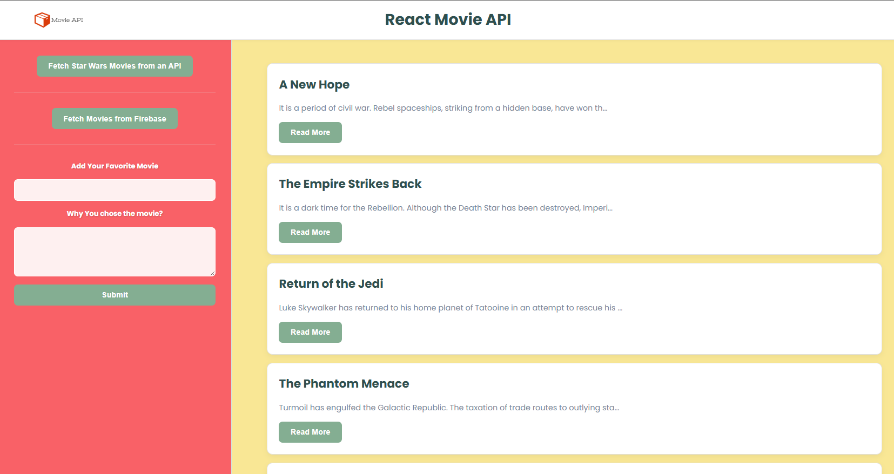

# React Movie Portfolio Project

[Live Demo](https://fetch-movie-app.vercel.app) | [GitHub Repository](https://github.com/viboverse/my-portfolio/tree/main/fetch-movie)

This is a stylish and functional single-page application built with React and Vite. It demonstrates core React principles by fetching movie data from two different sources—the public Star Wars API (SWAPI) and a Firebase Realtime Database—and allowing users to submit their own favorite movies.

The project features a clean, responsive, two-panel layout with a vibrant and colorful custom theme. It is designed to showcase skills in state management, asynchronous data handling, and modern front-end development practices.

## Screenshot



## Key Features

- **Dual API Integration:** Fetches and displays movie data from both a public REST API and a Firebase backend.
- **Add Your Own Movies:** Users can add new movies to the "favorites" list via a controlled form.
- **Dynamic UI:** The interface provides clear feedback to the user with distinct loading and error states.
- **Component-Based Architecture:** Built with a logical structure of reusable React components.
- **Modern Styling:** A fully responsive and custom-styled interface using modern CSS.

## Tech Stack

- **React** (including Hooks like `useState` and `useCallback`)
- **Vite** for a fast development experience
- **JavaScript (ES6+)**
- **CSS3** for custom styling and layout
- **Firebase** for the backend database of favorite movies

## Running This Project Locally

To get a local copy up and running, follow these simple steps.

### Prerequisites

You will need to have Node.js and npm installed on your machine.

### Installation

1.  Clone the entire portfolio repository:
    ```sh
    git clone https://github.com/viboverse/my-portfolio.git
    ```
2.  Navigate into this specific project's directory:
    ```sh
    cd my-portfolio/fetch-movie
    ```
3.  Install NPM packages:
    ```sh
    npm install
    ```
4.  Run the development server:
    ```sh
    npm run dev
    ```

The application will now be running on `http://localhost:5173` (or the next available port).
