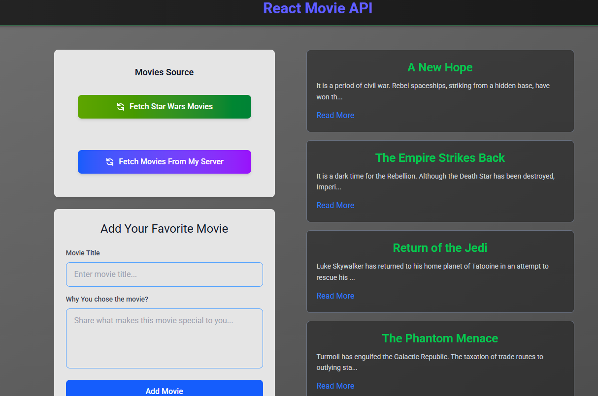

# React Movie Portfolio Project

[Live Demo](https://fetch-movie-app.vercel.app) | [GitHub Repository](https://github.com/viboverse/my-portfolio/tree/main/fetch-movie)

A modern React app showcasing dual API integration with the Star Wars API and Firebase. Features a clean, responsive design built with React, Vite, and Tailwind CSS.

## Screenshot



## Features

- **Dual API Integration:** Fetch movies from Star Wars API and Firebase Realtime Database
- **Add Favorites:** Submit your own movies with validation and error handling
- **Modern UI:** Responsive design with Tailwind CSS, loading states, and smooth interactions
- **Component Architecture:** Clean, reusable React components with proper state management

## Tech Stack

- **React** (Hooks: useState, useCallback)
- **Vite** for fast development
- **Tailwind CSS** for modern styling
- **Firebase** Realtime Database
- **JavaScript ES6+**

## Quick Start

```sh
git clone https://github.com/viboverse/my-portfolio.git
cd my-portfolio/fetch-movie
npm install
npm run dev
```

Open `http://localhost:5173` to view the app.
