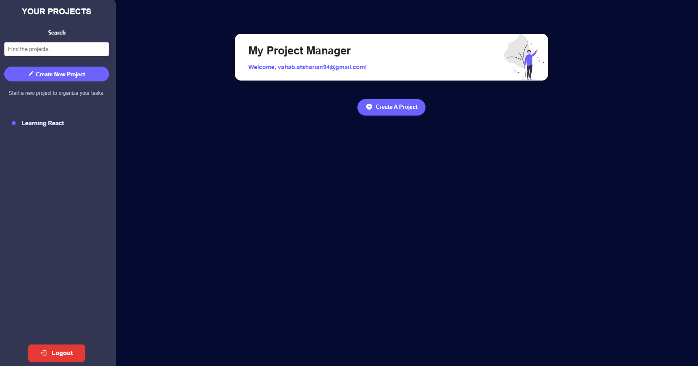

# My Project Manager (React + Vite)

A modern project and task management app built with React and Vite. Organize your projects, add tasks, and manage your productivity with a clean, responsive UI.

## Features

- **Authentication**: Simple login system (local state)
- **Project Management**: Create, view, and delete projects
- **Task Management**: Add and remove tasks for each project
- **Sidebar Navigation**: Quickly switch between projects
- **Responsive UI**: Modern design with custom CSS
- **SVG & Icon Integration**: Uses SVG illustrations and [react-icons](https://react-icons.github.io/react-icons/)
- **Error Handling**: Modal-based error feedback
- **React Context**: State management for auth, projects, and errors

## Screenshots



## Getting Started

### Prerequisites

- Node.js (v18 or newer recommended)
- npm

### Installation

```sh
npm install
```

### Running the App

```sh
npm run dev
```

Visit [http://localhost:5173](http://localhost:5173) in your browser.

### Building for Production

```sh
npm run build
```

## Folder Structure

```
src/
  components/      # React components
  context/         # React context providers
  modal/           # Modal component and styles
  util/            # Utility functions
  assets/          # Images and SVGs
  index.css        # Global styles
  App.jsx          # Main app component
```

## Future Improvements

- Backend integration (Firebase, REST API, etc.)
- Persistent authentication
- Unit and integration tests
- TypeScript migration
- More advanced state management
- Mobile-first enhancements
